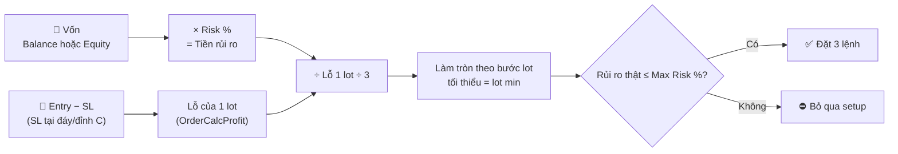
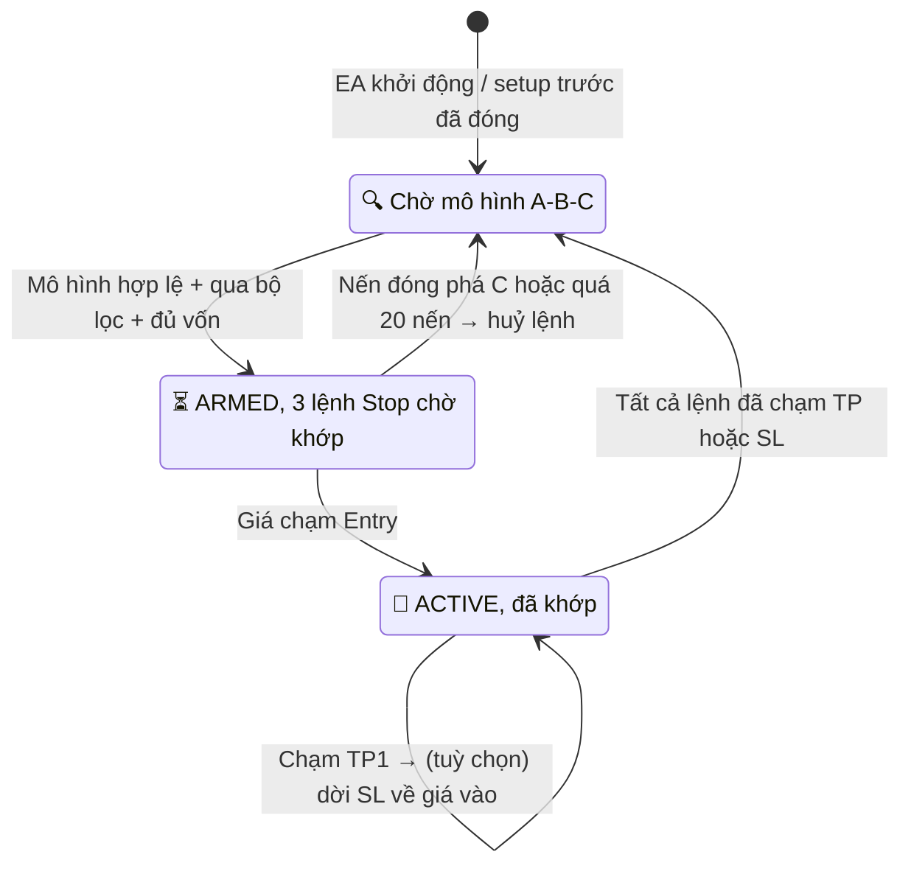
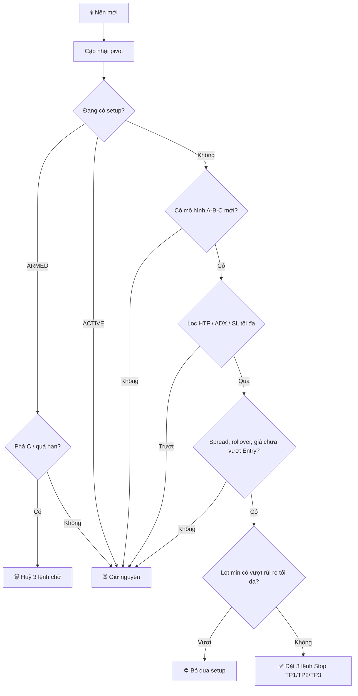

<div align="center">

# 🔱 Bot-EA-Trading-XAUUSD-TRIDENT-SWING

### Trident Swing EA cho MetaTrader 5

**EA MQL5 & nâng cấp:** © 2026 Hồ Ngọc Khánh ([@LiinIT](https://github.com/LiinIT))<br>
**Logic gốc:** *Trident Swing Projector* © **MarkitTick**

License: [CC BY-NC-SA 4.0](LICENSE). Chỉ dùng phi thương mại, phải ghi nguồn MarkitTick và LiinIT.

**Trident Swing EA of Khanh**<br>
**Donate coffee: 1907.5049.8560.17 (Techcombank) / 68814062001 (Techcombank) !!! Thanks**


</div>

---

## 📌 Tóm tắt trong 30 giây

- EA tìm **mô hình sóng A‑B‑C**: một nhịp đẩy (A→B), một nhịp hồi (B→C), rồi chờ giá đi tiếp theo hướng cũ.
- Khi mô hình hợp lệ, EA đặt sẵn **3 lệnh chờ Stop** tại cùng giá Entry. Ba lệnh dùng chung SL nhưng có 3 TP khác nhau: **1R, 2R, 3R**.
- **Khối lượng tự tính** sao cho nếu cả 3 lệnh dính SL thì chỉ mất đúng **X% vốn** (mặc định 1%).
- SL/TP nằm trên server broker, nên **mất mạng hay tắt máy thì lệnh vẫn được bảo vệ**.

| File | Mô tả |
|---|---|
| [`mt5/TRIDENT_SWING_EA.mq5`](mt5/TRIDENT_SWING_EA.mq5) | Expert Advisor cho MetaTrader 5 |
| [`LICENSE`](LICENSE) | CC BY-NC-SA 4.0 kèm ghi nguồn |

---

## 🧭 Dùng ở đâu, với điều kiện gì

| Điều kiện | Yêu cầu | Ghi chú |
|---|---|---|
| Nền tảng | **MetaTrader 5** | Không chạy trên MT4 |
| Loại tài khoản | **Hedging** (bắt buộc) | Tài khoản netting không giữ được 3 lệnh riêng, EA sẽ báo lỗi khi khởi động |
| Symbol | **XAUUSD** (đã thiết kế cho vàng) | Chạy được trên symbol khác, nhưng cần tự backtest lại |
| Khung thời gian | **M15 hoặc H1** | M1/M5 có quá nhiều pivot nhiễu, spread chiếm phần lớn R |
| Thời gian chạy | Bật **Algo Trading**; nên dùng **VPS** | Huỷ lệnh chờ và dời SL về hoà vốn cần EA đang chạy |
| Vốn tối thiểu | Xem bảng bên dưới | EA mở 3 lệnh, mỗi lệnh tối thiểu 0.01 lot |

### Vốn tối thiểu theo độ rộng SL (XAUUSD, 3 × 0.01 lot)

Mỗi $1 giá với 3 × 0.01 lot = **$3**. EA **bỏ qua setup** nếu rủi ro vượt `InpMaxRiskPercent` (mặc định 3%).

| Khoảng SL (Entry → SL) | Lỗ khi dính SL | Vốn tối thiểu để EA vào lệnh (giới hạn 3%) | Vốn để đúng mức rủi ro 1% |
|---|---|---|---|
| $3 | $9 | **$300** | $900 |
| $5 | $15 | **$500** | $1,500 |
| $10 | $30 | **$1,000** | $3,000 |
| $20 | $60 | **$2,000** | $6,000 |

👉 Với vốn **dưới ~$500**, phần lớn setup trên M15/H1 sẽ bị bỏ qua. Đây là cơ chế bảo vệ, không phải lỗi. Vốn nhỏ thì xem phần **tài khoản cent** bên dưới.

---

## 🧮 Công thức tự tính lot

SL của mỗi setup đặt ở **đáy gần nhất (C) khi BUY** hoặc **đỉnh gần nhất (C) khi SELL**, cộng thêm buffer nếu có. EA tính lot sao cho **nếu cả 3 lệnh dính SL thì chỉ mất đúng số tiền bạn chọn**:

```text
  Khoảng SL      = | Entry − SL |                       (SL = đáy/đỉnh C ± buffer)
  Lỗ / 1 lot     = Khoảng SL × Contract Size × giá trị tick    (EA dùng OrderCalcProfit)
  Tiền rủi ro    = Vốn × Risk %          (chế độ Rủi ro %)
                 = số tiền cố định       (chế độ Rủi ro tiền)
  Lot / lệnh     = làm tròn xuống ( Tiền rủi ro ÷ Lỗ 1 lot ÷ 3 )
  Rủi ro thật    = Lot / lệnh × 3 × Lỗ 1 lot   → nếu > Max Risk % thì BỎ QUA setup
```



### Ba chế độ tính lot (`InpLotMode`)

| Chế độ | Dùng khi | Tham số |
|---|---|---|
| **Rủi ro %** *(mặc định)* | Muốn lot tự lớn lên/nhỏ lại theo vốn (lãi kép) | `InpRiskPercent`, `InpCapitalBase` |
| **Rủi ro tiền** | Muốn mỗi setup mất tối đa một số tiền cố định, ví dụ $10 hoặc 1,000 USC | `InpRiskMoney` |
| **Lot cố định** | Muốn tự chọn lot; EA vẫn kiểm tra `InpMaxRiskPercent` | `InpFixedLot` |

### Ví dụ (XAUUSD, 1 lot = 100 oz, BUY với SL cách Entry $4)

| | Vốn $1,000 · Risk 1% | Vốn $5,000 · Risk 1% |
|---|---|---|
| Tiền rủi ro | $10 | $50 |
| Lỗ / 1 lot | $4 × 100 = $400 | $400 |
| Lot / lệnh (trước làm tròn) | 10 ÷ 400 ÷ 3 = 0.008 | 50 ÷ 400 ÷ 3 = 0.042 |
| Lot / lệnh (sau làm tròn) | **0.01** (nâng lên lot min) | **0.04** |
| Rủi ro thật (3 lệnh) | $12 = **1.2%** ✅ (≤ 3%) | $48 = **0.96%** ✅ |

Panel trên chart và tab Experts hiện đầy đủ phép tính mỗi lần đặt lệnh, ví dụ:
`[TRIDENT] LOT = 50.00 / (400.00 x 3) -> 0.04/lenh | capital 5000.00, SL 4.00, risk 48.00 USD (0.96%)`

---

## 🪙 Gợi ý: chạy trên tài khoản **cent** để có lợi thế về vốn

Ở tài khoản cent, số dư hiển thị bằng **cent (USC)**: nạp $50 thấy **5,000 USC**. Với phần lớn broker, **1 lot cent nhỏ hơn 100 lần** 1 lot standard, nên lot min 0.01 trên tài khoản cent chỉ rủi ro **1/100** so với tài khoản thường.

👉 Vì EA tính lỗ bằng `OrderCalcProfit` (theo đơn vị tiền tài khoản), **công thức trên chạy đúng cho tài khoản cent mà không cần chỉnh gì.**

### So sánh (XAUUSD, SL cách Entry $5, 3 lệnh lot min 0.01)

| | Standard | **Cent** |
|---|---|---|
| Lỗ khi dính SL (lot min) | $15 | 15 USC = **$0.15** |
| Vốn tối thiểu để EA vào lệnh (giới hạn 3%) | $500 | 500 USC = **$5** |
| Vốn để đúng rủi ro 1% | $1,500 | 1,500 USC = **$15** |
| Với $50 thật | Bỏ qua gần hết setup | Chạy **đúng 1%/setup**, lot tự tăng theo vốn |

### Lợi thế
- **Vốn nhỏ vẫn quản lý rủi ro chuẩn**: $20–$100 đã chạy được đúng 1%, thay vì bị làm tròn lên lot min rồi rủi ro 5–10%.
- **Lãi kép mượt hơn**: bước lot nhỏ gấp 100 lần nên lot tăng theo vốn từng chút một.
- **Chạy thật với tiền thật nhỏ**: kiểm chứng EA trên thị trường thật (trượt giá, spread thật) trước khi lên tài khoản standard.

### Lưu ý khi dùng cent
- ⚠️ Cent giúp **chia nhỏ rủi ro**, **không** làm tăng lợi nhuận: 1% của $50 vẫn là $0.50.
- Chọn tài khoản cent **MT5 hedging** (một số broker mặc định netting, EA sẽ không chạy).
- Symbol thường có **hậu tố**, ví dụ `XAUUSDc`. Gắn EA vào đúng chart symbol cent.
- Kiểm tra **Symbol Specification** (Contract size, Volume min/step/max). Mỗi broker quy định khác nhau.
- Tài khoản cent hay có **spread/phí cao hơn** và **giới hạn số dư hoặc lot tối đa**. Backtest với spread thật của broker.
- Gợi ý cài đặt: `InpLotMode = Rủi ro %`, `InpRiskPercent = 1–2`, `InpMaxRiskPercent = 3`, `InpCapitalBase = Balance`.

---

## ⚙️ Cách EA hoạt động

### 1. Tìm pivot (đỉnh/đáy sóng)
Một đỉnh/đáy chỉ được xác nhận khi có **5 nến mỗi bên** (`InpPivotLeft` / `InpPivotRight`). Pivot xác nhận trễ 6 nến nhưng **không bao giờ vẽ lại**.

### 2. Nhận diện mô hình A‑B‑C (ví dụ chiều BUY)

```text
 Giá
  ▲                                         TP3 ── 100% Leg ──┐
  │                 B                       TP2 ──  75% Leg   │
  │                ╱ ╲                      TP1 ──  50% Leg   │  đo từ C
  │               ╱   ╲             ┌──── ENTRY ── 25% Leg    │
  │              ╱     ╲      ╱─────┘                         │
  │             ╱       ╲    ╱                                │
  │            ╱         ╲  ╱                                 │
  │           ╱           C ─────────── SL (C − buffer) ──────┘
  │          ╱      hồi 23.6% – 78.6% của AB
  │         A
  └────────────────────────────────────────────────────────▶ thời gian
           Leg = B − A
```

| Điều kiện | BUY | SELL |
|---|---|---|
| Thứ tự | Đáy A → Đỉnh B → Đáy C | Đỉnh A → Đáy B → Đỉnh C |
| C so với A | C **cao hơn** A | C **thấp hơn** A |
| Độ hồi B→C | 23.6% – 78.6% của AB | 23.6% – 78.6% của AB |
| Trend filter | B phá đỉnh swing trước | B phá đáy swing trước |
| HTF / ADX *(tuỳ chọn)* | Khung lớn đang tăng / ADX ≥ ngưỡng | Khung lớn đang giảm / ADX ≥ ngưỡng |

### 3. Đặt lệnh

| Mức | Công thức (BUY) | Theo R (buffer = 0) |
|---|---|---|
| **Entry** (Buy Stop) | C + 25% Leg | — |
| **SL** | C − buffer | −1R |
| **TP1** (lệnh 1) | C + 50% Leg | **+1R** |
| **TP2** (lệnh 2) | C + 75% Leg | **+2R** |
| **TP3** (lệnh 3) | C + 100% Leg | **+3R** |

### 4. Vòng đời một setup



### 5. Luồng quyết định mỗi nến



---

## 💰 Tỉ lệ lợi nhuận: hiểu đúng để kỳ vọng đúng

> ⚠️ **Repo này chưa có kết quả backtest được kiểm chứng.** Không có con số "% lợi nhuận mỗi tháng" nào được cam kết. Phần dưới đây là **toán học của cấu trúc RR**, để bạn biết EA cần tỉ lệ thắng bao nhiêu mới có lãi.

### Kết quả của 1 setup (rủi ro 1R = `InpRiskPercent` % vốn, mặc định 1%)

Mỗi lệnh chiếm 1/3 khối lượng:

| Kịch bản | Không dời SL về hoà vốn | Có dời SL về hoà vốn (`InpUseBreakeven = true`) |
|---|---|---|
| 🔴 Dính SL trước TP1 | **−1R** | **−1R** |
| 🟠 Chạm TP1 rồi quay về SL | 1/3 − 2/3 = **−0.33R** | 1/3 + 0 + 0 = **+0.33R** |
| 🟡 Chạm TP2 rồi quay về SL | 1/3 + 2/3 − 1/3 = **+0.67R** | 1/3 + 2/3 + 0 = **+1R** |
| 🟢 Chạm đủ TP3 | (1 + 2 + 3)/3 = **+2R** | **+2R** |

### Tỉ lệ thắng cần để hoà vốn
- Nếu setup chỉ có 2 kết quả, **mất 1R** hoặc **ăn đủ +2R**: cần thắng **trên 33.3%** số setup.
- Ví dụ giả định (không phải backtest): 40% dính SL, 30% chỉ tới TP1, 20% tới TP2, 10% ăn đủ TP3.

| | Không dời SL về hoà vốn | Có dời SL về hoà vốn |
|---|---|---|
| Kỳ vọng mỗi setup | −0.40 − 0.10 + 0.13 + 0.20 = **−0.17R** ❌ | −0.40 + 0.10 + 0.20 + 0.20 = **+0.10R** ✅ |
| 100 setup, rủi ro 1% | ≈ **−17%** vốn | ≈ **+10%** vốn |

👉 Cùng một thị trường, chỉ bật dời SL về hoà vốn đã đổi kết quả từ lỗ sang lãi trong ví dụ này. **Hãy backtest cả hai chế độ.**

### Những thứ làm R thực tế xấu đi
- **Spread và trượt giá:** lệnh Buy Stop khớp ở Ask, SL kích hoạt ở Bid, nên mỗi setup mất thêm vài phần trăm R.
- **Buffer SL:** bật buffer làm R lớn hơn, trong khi TP vẫn đo từ C, nên TP1/TP2/TP3 tính theo R sẽ **dưới** 1R/2R/3R.
- **Làm tròn lot:** vốn nhỏ thì lot bị làm tròn lên mức tối thiểu, rủi ro thật có thể cao hơn 1%.

### Tự đo bằng Strategy Tester
1. **Ctrl+R** → chọn `TRIDENT_SWING_EA` → XAUUSD → M15 hoặc H1.
2. Modelling: **Every tick based on real ticks**. Nhập commission đúng như broker.
3. Chạy **12 tháng**, ghi lại: số setup, Profit Factor, Max Drawdown, kỳ vọng mỗi lệnh.
4. Tối ưu trên 6 tháng đầu, rồi **kiểm tra lại trên 6 tháng sau** (out-of-sample). Kết quả chỉ đáng tin nếu giai đoạn sau vẫn có lãi.

---

## 🆚 Khác gì bản gốc của MarkitTick

*Trident Swing Projector* gốc là **indicator TradingView**: nó chỉ vẽ mức giá và bắn alert, không tự giao dịch.

### ✅ Giữ nguyên logic gốc
- Pivot trái/phải, chỉ đọc nến đã đóng (không repaint).
- Điều kiện A‑B‑C, khoảng hồi 23.6–78.6%, trend filter.
- Thang mức **25% / 50% / 75% / 100%** của chân sóng (khái niệm Trident của Charles Lindsay).
- SL tại C ± buffer (Ticks hoặc ATR), huỷ setup khi phá C hoặc quá hạn.
- Bộ lọc HTF và ADX (tuỳ chọn).

### 🚀 Nâng cấp bởi LiinIT

| Nâng cấp | Lợi ích |
|---|---|
| **Tự giao dịch** bằng 3 lệnh Stop đặt sẵn, mỗi lệnh một TP | Không cần ngồi canh chart, chốt lời từng phần tự động |
| **Tự tính lot theo vốn và SL tại đáy/đỉnh C**: 3 chế độ Rủi ro % / Rủi ro tiền / Lot cố định, dùng `OrderCalcProfit` | Rủi ro mỗi setup luôn đúng mức chọn, không phụ thuộc độ rộng SL, chạy đúng cả trên tài khoản cent |
| **Chặn rủi ro tối đa và kiểm tra margin** | Không vào lệnh nếu lot tối thiểu vẫn quá rủi ro hoặc không đủ ký quỹ |
| **Khôi phục trạng thái** qua Global Variables | Khởi động lại MT5 hay đổi khung thời gian, EA vẫn nhận lại và quản lý lệnh cũ |
| **Lọc spread và giờ rollover** | Tránh đặt lệnh lúc spread XAU giãn rộng |
| **Giới hạn SL theo ATR** | Bỏ qua các sóng quá lớn |
| **ADX kiểu Wilder** (`iADXWilder`) | Khớp với `ta.dmi` của TradingView |
| **Sửa lỗi bỏ lỡ setup** | Bản gốc bỏ qua setup mới nếu lệnh cũ vừa đóng cùng nến đó |
| **Bỏ "Signal Smoothing"** | Ở bản gốc nó làm mượt theo nến chứ không theo sóng, gần như không có tác dụng |
| **Vẽ A/B/C, Entry, SL, TP** và panel trạng thái | Dễ đối chiếu với TradingView |

### ⚖️ Khác biệt cần biết
- Bản gốc vào lệnh khi **nến đóng vượt Entry**; EA dùng **lệnh Stop**, nên khớp ngay khi giá chạm Entry. Giá vào sát Entry hơn, nhưng dễ bị râu nến quét.
- Nếu lúc setup được xác nhận mà **giá đã vượt Entry**, EA bỏ qua setup đó, nên số lệnh có thể **ít hơn** số setup vẽ trên TradingView.

---

## 🛠️ Cài đặt

1. MT5 → **File → Open Data Folder → `MQL5/Experts`** → copy `mt5/TRIDENT_SWING_EA.mq5` vào.
2. **MetaEditor** (F4) → mở file → **Compile** (F7).
3. Kéo EA vào chart **XAUUSD M15/H1** của tài khoản **hedging** → bật **Algo Trading**.
4. Bật `InpDrawLevels` để thấy A/B/C, Entry, SL, TP trên chart.
5. Chạy **demo ít nhất 2–4 tuần** trước khi dùng tiền thật.

> Gỡ EA khỏi chart **không xoá** các lệnh chờ. Gắn lại EA thì nó tự nhận lại và quản lý tiếp.

## 🎛️ Tham số chính

| Nhóm | Tham số | Mặc định | Ý nghĩa |
|---|---|---|---|
| Core | `InpPivotLeft` / `InpPivotRight` | 5 / 5 | Số nến mỗi bên để xác nhận pivot |
| Core | `InpSwingUnit` | Points | Đo chân sóng theo giá hoặc theo % |
| Filters | `InpUseTrend` | true | B phải phá swing trước |
| Filters | `InpMinPullback` / `InpMaxPullback` | 23.6 / 78.6 | Khoảng hồi hợp lệ của B→C |
| Filters | `InpUseHtf`, `InpHtfTimeframe` | false, H4 | Xác nhận xu hướng khung lớn |
| Filters | `InpUseAdx`, `InpAdxThreshold` | false, 20 | Chỉ vào lệnh khi có xu hướng đủ mạnh |
| Entry/Exit | `InpStopBufferMode` | None | Buffer SL theo Points hoặc ATR (XAU nên dùng ATR 0.1–0.2) |
| Entry/Exit | `InpExpiryBars` | 20 | Huỷ lệnh chờ sau N nến |
| Entry/Exit | `InpUseBreakeven` | false | Dời SL về giá vào sau TP1 |
| Risk | `InpLotMode` | Rủi ro % | Cách tính lot: Rủi ro % / Rủi ro tiền / Lot cố định |
| Risk | `InpCapitalBase` | Balance | Vốn dùng để tính: Balance hoặc Equity |
| Risk | `InpRiskPercent` | 1.0 | [Rủi ro %] % vốn rủi ro cho cả 3 lệnh |
| Risk | `InpRiskMoney` | 10.0 | [Rủi ro tiền] số tiền mỗi setup (tài khoản cent tính bằng USC) |
| Risk | `InpFixedLot` | 0.01 | [Lot cố định] lot mỗi lệnh |
| Risk | `InpMaxRiskPercent` | 3.0 | Rủi ro thật vượt mức này (% vốn) thì bỏ qua setup |
| Risk | `InpMaxStopAtr` | 0 (tắt) | Bỏ qua sóng có SL > N × ATR |
| Protection | `InpMaxSpreadPoints` | 0 (tắt) | Lọc spread |
| Protection | `InpUseRolloverFilter` | true | Không đặt lệnh 23:50–01:10 giờ server |
| System | `InpMagicNumber` | 20261002 | Phân biệt lệnh của EA |

---

## ⚠️ Cảnh báo rủi ro

- Dự án **phi thương mại, phục vụ học tập**. Không phải lời khuyên đầu tư.
- Lệnh Stop có thể **trượt giá mạnh** lúc ra tin (NFP, CPI, FOMC). Nên tắt EA quanh các thời điểm này.
- Kết quả backtest không đảm bảo cho tương lai. Luôn chạy demo trước.

---

<div align="center">

## ☕ Ủng hộ tác giả

**Trident Swing EA of Khanh**<br>
**Donate coffee: 1907.5049.8560.17 (Techcombank) / 68814062001 (Techcombank) !!! Thanks**

Donate là **tự nguyện**: EA miễn phí cho mọi người theo license CC BY-NC-SA 4.0.

**EA MQL5 & nâng cấp:** © 2026 Hồ Ngọc Khánh (LiinIT)<br>
**Logic gốc:** *Trident Swing Projector* © MarkitTick — [CC BY-NC-SA 4.0](LICENSE)

</div>
